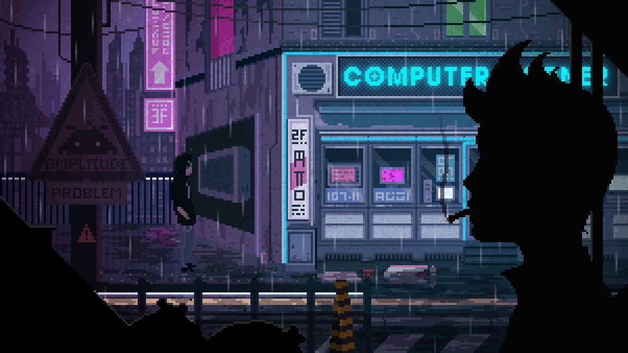

<p align="center">
<a href="https://github.com/danield36/mongodb-express-movies-openai">
 </a>
</p>
<div align="center">
  
  [](https://github.com/danield36/mongodb-express-movies-openai)

  <p align="center">
<a href="https://github.com/danield36/mongodb-express-movies-openai">
</a>
</p>

<a href="https://github.com/danield36/mongodb-express-movies-openai">
  
  <a/>
</a>


<br/>

# Movies and Recommendations CRUD App
  
  </div>


This is a full CRUD (Create, Read, Update, Delete) application for managing movies and obtaining movie recommendations. The application uses Node.js, MongoDB, Mongoose ODM, and integrates with OpenAI's ChatGPT for movie recommendations.

## Table of Contents

- [Features](#features)
- [Technologies Used](#technologies-used)
- [Installation](#installation)
- [Usage](#usage)
- [API Endpoints](#api-endpoints)
- [OpenAI Integration](#openai-integration)
- [License](#license)

## Features

- Create, Read, Update, and Delete movies.
- Get movie recommendations using OpenAI's ChatGPT.
- RESTful API for easy integration.

## Technologies Used

- Node.js
- MongoDB
- Mongoose ODM
- OpenAI (ChatGPT)

## Installation

1. Fork then Clone the repository:


2. Install dependencies:

    ```bash

    npm install
    ```

3. Configure MongoDB:

    - Ensure MongoDB is installed on your machine.
    - Update the MongoDB connection string `.

4. Set up OpenAI API Key:

    - Get your OpenAI API key.
    - Update the API key .

## Usage

Start the server:

```bash
npm start
```

Visit `http://localhost:3000` in your browser to access the application.

## API Endpoints

- **GET /movies**: Get all movies.
- **GET /movies/:id**: Get a specific movie.
- **POST /movies**: Create a new movie.
- **PATCH /movies/:id**: Update a movie.
- **DELETE /movies/:id**: Delete a movie.

## OpenAI Integration

The application integrates with OpenAI's ChatGPT for movie recommendations. Ensure your OpenAI API key is set up 

## License

This project is licensed under the MIT License - see the [LICENSE](LICENSE) file for details.


<div align="center">
  
<details>

<summary>👏 Thanks for the support </summary>

## Stargazers


<div align="center">

[](https://github.com/danield36/mongodb-express-movies-openai/stargazers)


</div>

## Forkers

<div align="center" >

[](https://github.com/danield36/mongodb-express-movies-openai/network/members)

</div>

## Contributors

<a href = "https://github.com/danield36">
  
</a>


<br/></details><br/>

<div align="center">


</div>
<div align="center">


</div>

 <p align="center">
<a href="https://www.buymeacoffee.com/danield36"></a>
</p>


<a href = "https://github.com/danield36">
  
</a>

<a href = "https://github.com/danield36">
  
</a>

<a href = "https://github.com/danield36">
  
</a>


𝚂𝚑𝚘𝚠 𝚜𝚘𝚖𝚎 💙 𝚋𝚢 𝚜𝚝𝚊𝚛𝚛𝚒𝚗𝚐 ⭐ 𝚝𝚑𝚎 𝚛𝚎𝚙𝚘𝚜𝚒𝚝𝚘𝚛𝚢!

<br/>


<p align="center"><a href="#"></a></p>


